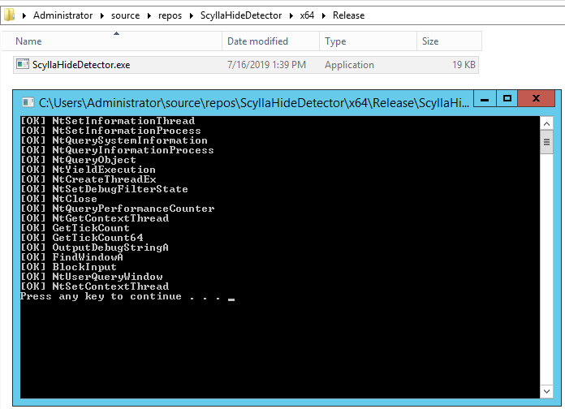
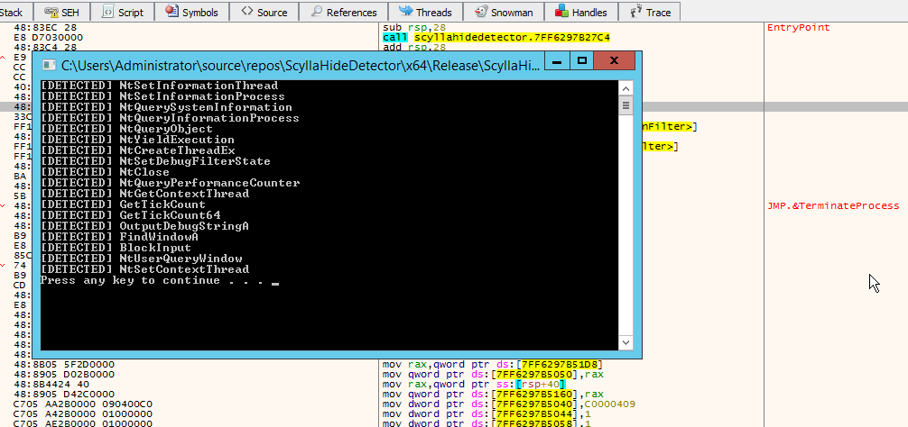

# ScyllaHide Detector

# NEW Version
Check here version 2 https://github.com/lurumdare/ScyllaHideDetector2 with restore bytes.

Allows you to find the use of ScyllaHide, if your program will debug.

## TODO
- [ ] win32u.dll signatures
- [ ] support x86 

## Done

- [x] NtSetInformationThread
- [x] NtSetInformationProcess
- [x] NtQuerySystemInformation
- [x] NtQueryInformationProcess
- [x] NtQueryObject
- [x] NtYieldExecution
- [x] NtCreateThreadEx
- [x] NtSetDebugFilterState
- [x] NtClose
- [x] NtQueryPerformanceCounter
- [x] NtGetContextThread
- [x] GetTickCount
- [x] GetTickCount64
- [x] OutputDebugStringA
- [x] FindWindowA
- [x] BlockInput
- [x] NtUserQueryWindow
- [x] NtSetContextThread
- [x] GetLocalTime
- [x] GetSystemTime

## Screenshots

Detection

## Thanks
Kirie Motoba (inject.ws russian re forum)
